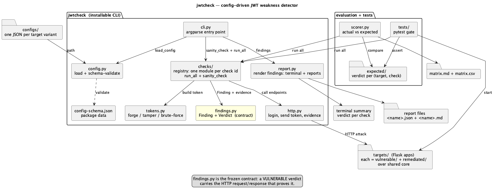
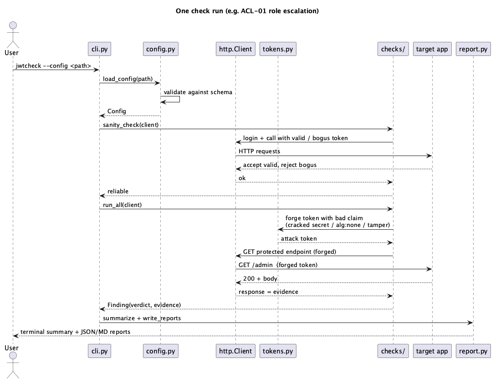

# Development

Setup, the demo targets, and how detection is proven. To use the tool against
your own app, see [README.md](README.md).

## Setup

```sh
python -m venv .venv
source .venv/bin/activate
pip install -e ".[dev]"
```

Editable install, so edits to the tool are live without reinstalling. The `dev`
extra adds Flask and cryptography (to run the demo targets) and pytest.

## Demo targets

The repo ships four demo apps under `targets/`, each with a vulnerable and,
where relevant, a remediated variant over shared core. Their configs are in
`configs/`, and each app's default port matches its config's `base_url`.

- **header-auth** (5001 / 5002): token in `Authorization: Bearer`, `role`/`sub`
  claims. The reference target.
- **cookie-auth** (5006 / 5007): token in a cookie, `scope`/`uid` claims,
  different endpoints. Same tool, config only. The reusability proof.
- **rsa-auth** (5003 / 5004): RS256, which enables the SIG-03 algorithm
  confusion check.
- **trusting-auth** (5005): verifies signatures but skips the claim checks, so
  one run shows a mix of SAFE and VULNERABLE.

Run one and point the tool at it:

```sh
python targets/header-auth/vulnerable/app.py &
jwtcheck --config configs/header-auth-vulnerable.json
kill %1
```

## Tests

```sh
pytest
```

The suite starts each target on a free port and asserts the actual verdicts
match `evaluation/expected/`. There are no servers to start by hand. Lint with
`ruff check`.

## Scored matrix

The scorer compares actual verdicts against the expected manifest and writes a
matrix with precision, recall, and the explicit false-positive and missed-case
lists. It expects the targets already running, so start the ones you want scored
first (all of them for the full matrix), then:

```sh
python evaluation/scorer.py
```

It writes `evaluation/matrix.md` and `evaluation/matrix.csv`.

## Adding a demo target

1. Add `targets/<name>/vulnerable/app.py`, and `remediated/` if relevant, over
   the shared core.
2. Add `configs/<name>-*.json` describing it.
3. Add `evaluation/expected/<name>-*.json` with the expected verdict per check
   id.

The test suite and the scorer scan `evaluation/expected/`, so the new target is
picked up automatically.

## Diagrams

Architecture:



One run, step by step:



Sources are `docs/architecture.puml` and `docs/sequence.puml`. Re-render with:

```sh
plantuml -tpng docs/architecture.puml docs/sequence.puml
```
